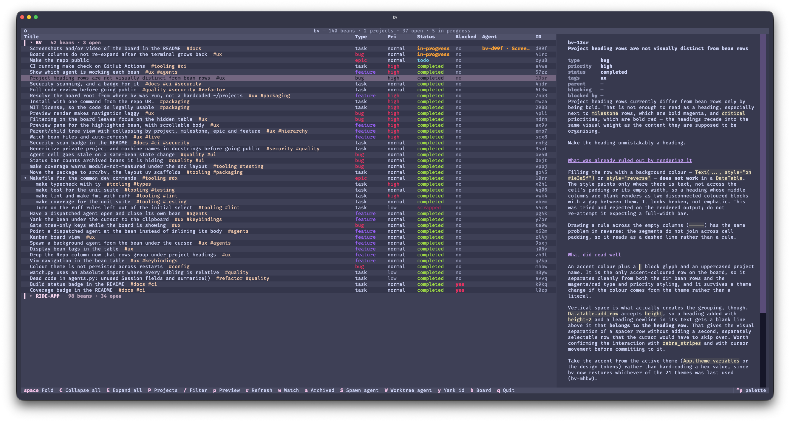

# bv

> A terminal viewer for [beans](https://github.com/hmans/beans) issues — every repo at once, with a kanban board, themes, and Claude agent dispatch.

[](https://github.com/dlhedglin/bv/actions/workflows/ci.yml)
[](https://github.com/dlhedglin/bv/actions/workflows/security.yml)
[](https://github.com/dlhedglin/bv/actions/workflows/coverage.yml)



bv reads the beans the [`beans`](https://github.com/hmans/beans) CLI writes and
adds what `beans tui` does not:

- **Every repo at once.** `beans tui` searches upward for a single `.beans.yml`,
  so it only ever shows one project. bv addresses projects explicitly, so a
  whole directory of repos becomes one screen.
- **Two views.** A folding tree, or a kanban board grouped by status. `b` swaps
  between them.
- **Themes and vim keys.** A theme picker in the command palette; `hjkl`,
  `gg`/`G`, `ctrl+d`/`ctrl+u` for navigation.
- **Claude agents.** Dispatch a background Claude Code session on a bean, on the
  main checkout or in an isolated git worktree, and see which session is working
  which bean in the Agent column.

## Table of Contents

- [Install](#install)
- [Usage](#usage)
- [Maintainers](#maintainers)
- [Contributing](#contributing)
- [License](#license)

## Install

bv reads the beans the `beans` CLI writes, so that comes first — without it
there is nothing to view:

```sh
brew install --cask hmans/beans/beans
```

Then bv itself, which needs no clone and no PyPI account:

```sh
uv tool install git+https://github.com/dlhedglin/bv
```

That puts `bv` on `PATH`. Python 3.11 or newer;
[uv](https://docs.astral.sh/uv/) downloads one if the machine has none.
`uv tool upgrade bv` moves to the latest commit, `uv tool uninstall bv` removes
it.

To try it without installing anything:

```sh
uvx --from git+https://github.com/dlhedglin/bv bv
```

## Usage

```sh
bv                 # browse the beans where you are
bv /path/to/repos  # browse somewhere else
```

What bv shows depends on where it runs:

- **A beans project** (a directory holding `.beans.yml` and `.beans/`) is the
  whole board, shown flat.
- **A directory of repos** is scanned one level down and the board is grouped by
  project.

Scanning is one level, never a recursive walk. A directory that is neither is an
empty board that says so.

### Keys

| key | |
| --- | --- |
| `j` / `k`, or the arrows | move down / up |
| `gg` / `G` | first / last row (tree only) |
| `h` / `l` | previous / next column (board only) |
| `ctrl+d` / `ctrl+u` | half a page down / up |
| `space` / `enter` | fold or unfold the row under the cursor (tree only) |
| `C` / `E` | collapse all / expand all (tree only) |
| `P` | collapse to project headings (tree only, multi-project boards) |
| `/` | filter by title, id, tag, type or status |
| `esc` | clear the filter |
| `r` | reload now |
| `a` | show or hide archived beans |
| `b` | switch between the tree and the kanban board |
| `S` | start a background Claude agent on this bean (asks first) |
| `W` | start one in an isolated git worktree (asks first) |
| `y` / `Y` | copy this bean's id / its id, title and status |
| `w` | pause or resume watching |
| `ctrl+p` | command palette, including the theme picker |
| `q` | quit |

The board refreshes itself when bean files change, so it stays current while
agents write to it in the background. Fold state and the chosen theme are
remembered across restarts.

### Starting an agent

`S` opens a confirmation showing the working directory, the session name and the
whole prompt, then dispatches `claude --bg` on the bean; the agent edits the
project's checkout directly. `W` does the same but adds `--worktree`, so the
agent lands in an isolated git worktree on its own branch — its edits reach the
main checkout only when that branch is merged. Either way the dialog asks first,
because there is no undo beyond `claude stop`.

bv chooses the session `--name` and puts the bean id in it, which is what makes
the Agent column an exact match for anything bv started rather than a guess from
a working directory. It is a warning, never a lock: beans has no assignee field,
so a second agent started elsewhere is noted but not prevented.

## Maintainers

[@dlhedglin](https://github.com/dlhedglin)

## Contributing

```sh
uv sync && uv run bv   # run it from the repo
make hooks             # install the pre-commit gate (once per clone)
make check             # typecheck, lint and the test suite — run before committing
make help              # every other target
```

`make hooks` points git at the version-controlled `.githooks/pre-commit`, which
runs `make check` before each commit — the same gate CI enforces. Bypass a
single commit with `git commit --no-verify`.

Issues and pull requests are welcome. Please run `make check` before opening a
PR.

## License

[MIT](LICENSE)
